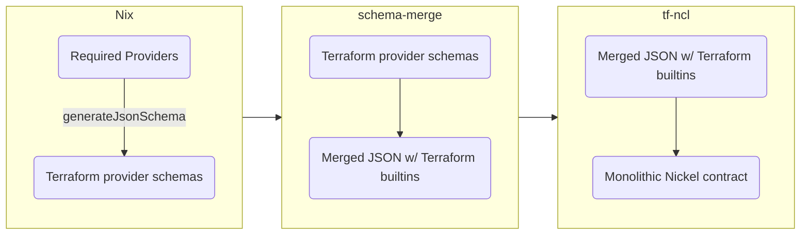

# Terraform Configurations With Nickel

This repository contains tooling for generating
[Nickel](https://github.com/tweag/nickel) contracts out of
[Terraform](https://www.terraform.io) provider schemas.

It enables configurations to be checked against provider specific contracts
before calling Terraform to perform the deployment. Nickel can natively generate
outputs as JSON, YAML or TOML. Since Terraform can accept its deployment
configuration as JSON, you can straightforwardly export a Nickel configuration,
adhering to the right format, to Terraform. Tf-Ncl provides a framework for
ensuring a Nickel configuration has this specific format. Specifically, Tf-Ncl
is a tool to generate Nickel contracts that describe the configuration schema
expected by a set of Terraform providers.

## Starting a Tf-Ncl configuration

The easiest way to get started is to use the `hello-tf` flake template:

```console
nix flake init -t github:tweag/tf-ncl#hello-tf
```

This will leave you with a `flake.nix` file containing some glue code for
getting a Nickel contract out of `tf-ncl`, evaluating a Nickel configuration
and calling Terraform. It's as easy as

```console
nix develop -c run-terraform init
nix develop -c run-terraform apply
```

Without Nix it's a bit more complicated. You will need to obtain the Nickel
contract using the tools in this repository. Take a look at [the working
principle](#how) for an overview of the process. The most involved step will be
calling `schema-merge` with extracted Terraform provider schemas, see [the nix
code](nix/terraform_schema.nix) for inspiration.

Once you have a project set up, you can start writing Nickel configuration
code. To quote from the `hello-tf` example:

```nickel
let Tf = import "./schema.ncl" in
{
  config.resource.null_resource.hello-world = {
    provisioner.local-exec = [{
      command = m%"
        echo 'Hello, world!'
      "%
    }],
  },
} | Tf.Config
```

Anything goes! You just need to ensure that your Terraform configuration ends
up in the toplevel attribute `config` and that your entire configuration
evaluates to a record satisfying the `Tf.Config` contract.

To actually turn the Nickel code into a JSON configuration file understood by
Terraform, you need to call `nickel` to export the `renderable_config` toplevel
attribute introduced by the `Tf.Config` contract:

```console
nickel export <your-toplevel-file.ncl> --field renderable_config
```

This can be useful for inspecting the result of your code. But usually it will
be easier to use the wrapper script for Terraform provided in the [`hello-tf`
flake template](examples/hello-tf/flake.nix).

For inspiration on what's possible with Nickel, take a look at [the
examples](examples/). Happy hacking!

## How

Unfortunately, Terraform doesn't expose an interface for extracting a machine
readable specification for the provider independent configuration it supports.
Because of that this repository contains two tools and some glue written in
Nix. Maybe this flowchart helps:



The entire process is packaged up in a Nix function `generateSchema` which is
exposed as a flake output. Also, to generate a Nickel contract for a single
provider, there is a flake output `schemas`:

```console
nix build github:tweag/tf-ncl#schemas.aws
```

All providers available in `nixpkgs` are supported. The `generateSchema`
function can also be called manually. For example, to get a monolithic Nickel
schema for the `aws`, `github` and `external` Terraform providers, you could
use

```console
nix build --impure --expr \
  '(builtins.getFlake "github:tweag/tf-ncl).generateSchema.${builtins.currentSystem} (p: { inherit (p) aws github external; })'
```

## Status

This project is in active development and breaking changes should be expected.

- [x] Automatic contracts for Terraform provider schemas
- [x] Contracts for Terraform state backends [#14][i14], [#15][i15]
- [ ] More documentation [#13][i13]
- [ ] Natural handling of field references [#12][i12]

[i12]: https://github.com/tweag/tf-ncl/issues/12
[i13]: https://github.com/tweag/tf-ncl/issues/13
[i14]: https://github.com/tweag/tf-ncl/issues/14
[i15]: https://github.com/tweag/tf-ncl/issues/15

