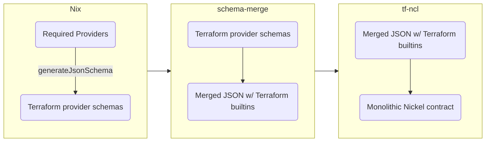

# Terraform Configurations With Nickel

This repository contains tooling for generating [Nickel](https://github.com/tweag/nickel) contracts out of [Terraform](https://www.terraform.io) provider schemas.

- Describe result
- How to start a project with this
- How to get schemas for nixpkgs terraform

## How?
Unfortunately, Terraform doesn't expose an interface for extracting a machine readable specification for the provider independent configuration it supports. Because of that this repository contains two tools and some glue written in Nix. Maybe this flowchart helps:



The entire process is packaged up in a Nix function `generateSchema` which is exposed as a flake output. It can be called manually, for example, to get a monolithic Nickel schema for the `aws`, `github` and `external` Terraform providers:
```shell
nix build --impure --expr '(builtins.getFlake "github:tweag/tf-ncl).generateSchema.${builtins.currentSystem}' (p: { inherit (p) aws github external; })
```

All providers in `nixpkgs` are supported. If you only want to use a single provider, it's easier. For example to get only the `aws` provider schema as a Nickel contract, you can use
```shell
nix build github:tweag/tf-ncl#schemas.aws
```

## Status

This project is in active development and breaking changes should be expected.

- [x] Automatic contracts for Terraform provider schemas
- [ ] More documentation [#13][i13]
- [ ] Natural handling of field references [#12][i12]
- [ ] Contracts for Terraform state backends [#14][i14], [#15][i15]

[i12]: https://github.com/tweag/tf-ncl/issues/12
[i13]: https://github.com/tweag/tf-ncl/issues/13
[i14]: https://github.com/tweag/tf-ncl/issues/14
[i15]: https://github.com/tweag/tf-ncl/issues/15

