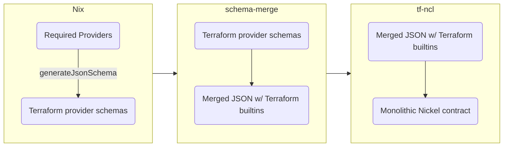

# Terraform Configurations With Nickel

This repository contains tooling for generating [Nickel](https://github.com/tweag/nickel) contracts out of [Terraform](https://www.terraform.io) provider schemas.

- Describe result
- How to start a project with this
- How to get schemas for nixpkgs terraform

## Starting a Tf-Ncl configuration
The easiest way to get started is to use the `hello-tf` flake template:
```shell
nix flake init -t github:tweag/tf-ncl#hello-tf
```
This will leave you with a `flake.nix` file containing some glue code for getting a Nickel contract out of `tf-ncl`, evaluating a Nickel configuration and calling Terraform. It's as easy as
```shell
nix run .#terraform -- hello-tf.ncl init
nix run .#terraform -- hello-tf.ncl apply
```

Without Nix it's a bit more complicated. You will need to obtain the Nickel contract using the tools in this repository, see [](how).

## How?
Unfortunately, Terraform doesn't expose an interface for extracting a machine readable specification for the provider independent configuration it supports. Because of that this repository contains two tools and some glue written in Nix. Maybe this flowchart helps:



The entire process is packaged up in a Nix function `generateSchema` which is exposed as a flake output. Also, to generate a Nickel contract for a single provider, there is a flake output `schemas`:
```shell
nix build github:tweag/tf-ncl#schemas.aws
```
All providers available in `nixpkgs` are supported. The `generateSchema` function can also be called manually. For example, to get a monolithic Nickel schema for the `aws`, `github` and `external` Terraform providers, you could use
```shell
nix build --impure --expr '(builtins.getFlake "github:tweag/tf-ncl).generateSchema.${builtins.currentSystem} (p: { inherit (p) aws github external; })'
```

## Status

This project is in active development and breaking changes should be expected.

- [x] Automatic contracts for Terraform provider schemas
- [x] Contracts for Terraform state backends [#14][i14], [#15][i15]
- [ ] More documentation [#13][i13]
- [ ] Natural handling of field references [#12][i12]

[i12]: https://github.com/tweag/tf-ncl/issues/12
[i13]: https://github.com/tweag/tf-ncl/issues/13
[i14]: https://github.com/tweag/tf-ncl/issues/14
[i15]: https://github.com/tweag/tf-ncl/issues/15

